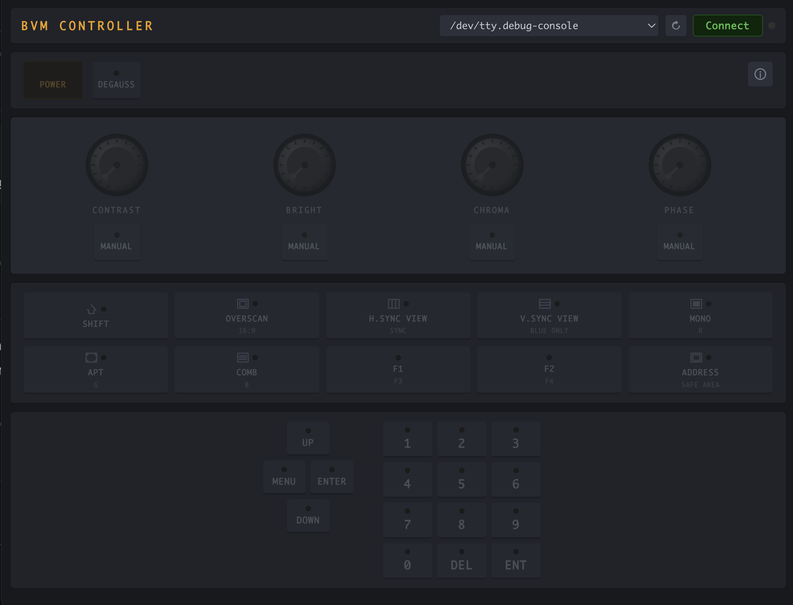

# BVM Controller

Desktop app for controlling Sony BVM CRT monitors over RS-422, replacing the physical BKM-10R controller unit.

[](https://ko-fi.com/onitoxan)



---

## Downloads

Pre-built binaries are available on the [Releases](https://github.com/Onitoxan/bvm-controller/releases) page.

| Platform | Format |
|----------|--------|
| macOS (Apple Silicon + Intel) | `.dmg` |
| Windows | `.exe` installer |

---

## Compatible monitors

- Sony BVM-14F1E / BVM-14F1U
- Sony BVM-14E1E / BVM-14E1U
- Sony BVM-14F5E / BVM-14F5U
- Sony BVM-20F1E / BVM-20F1U
- Sony BVM-20EF1E / BVM-20EF1U


Any Sony BVM that uses the BKM-10R controller unit should work.

---

## Hardware requirements

- USB to RS-422 full-duplex adapter (FTDI-based recommended)
- DB9 male connector wired to the BVM's RS-422 port
- 5-wire connection: RX+, RX-, TX+, TX-, GND

**Never connect pin 5 (+5V). Always plug and unplug the DB9 cable with the monitor powered off.**

---

## Wiring

The app includes a built-in pinout diagram (click the info button) it's easier to follow so I recommend you look it up there. For reference, the official pinout is documented in the [Sony BVM service manual](https://ia801707.us.archive.org/9/items/SonyBVM14EBVM14FBVM20EBVM20F20F1U14F5UOperationAndMaintenanceManual/Sony%20BVM-14E%20BVM-14F%20BVM-20E%20BVM-20F%2020F1U%2014F5U%20Operation%20and%20Maintenance%20Manual.pdf).

| DB9 Pin | BVM signal | Adapter wire |
|---------|-----------|--------------|
| 1       | GND       | GND          |
| 2       | -TXD      | TX-          |
| 3       | +RXD      | RX+          |
| 4       | GND       | GND          |
| 5       | +5V       | do not connect |
| 6       | GND       | GND          |
| 7       | +TXD      | TX+          |
| 8       | -RXD      | RX-          |
| 9       | GND       | GND          |

---

## Building from source

```bash
npm install
npm run dev        # development
npm run package    # build distributable
```

Requires Node.js 18+.

---

## Known issues

- Knobs may not work sometimes.
- LED state is received for button groups 2-4 only. The power LED state is not reported by the monitor over RS-422.

---

## License

MIT
